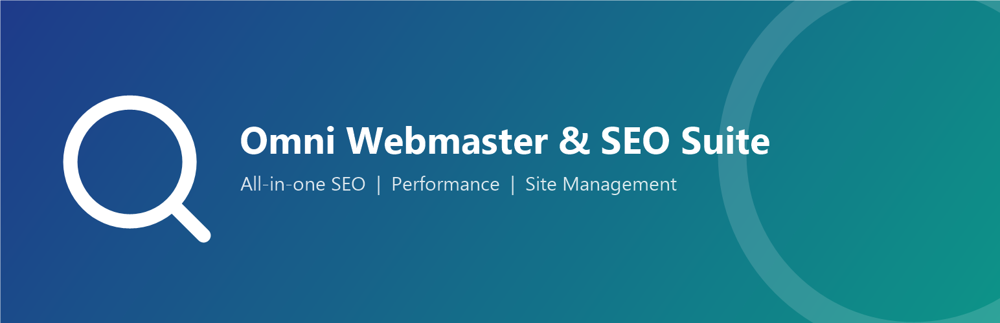
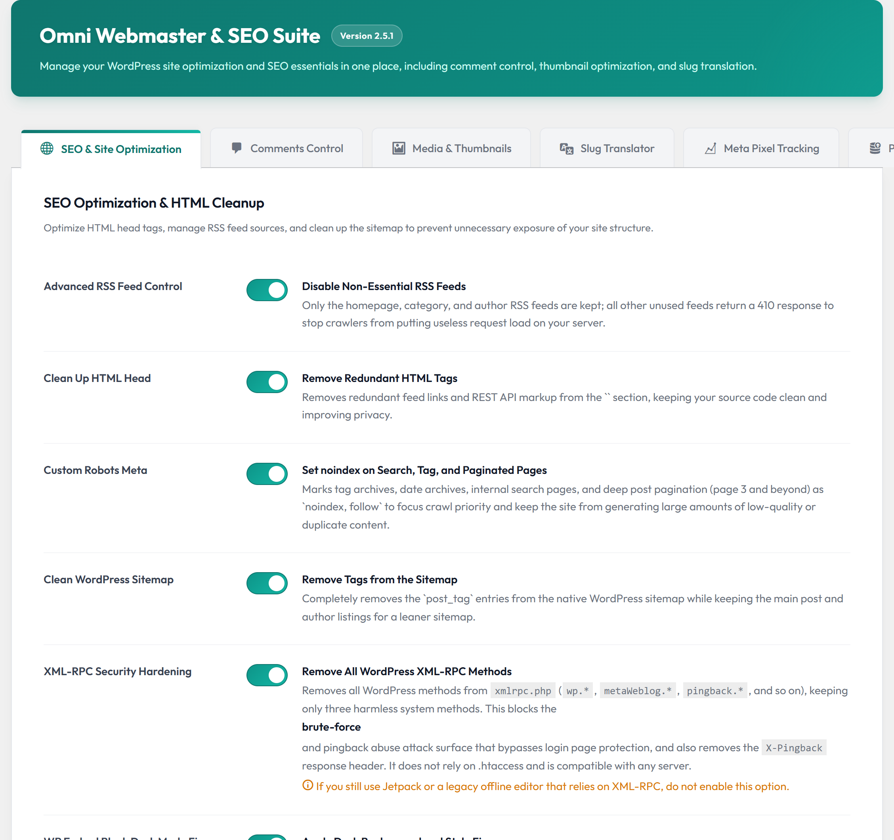
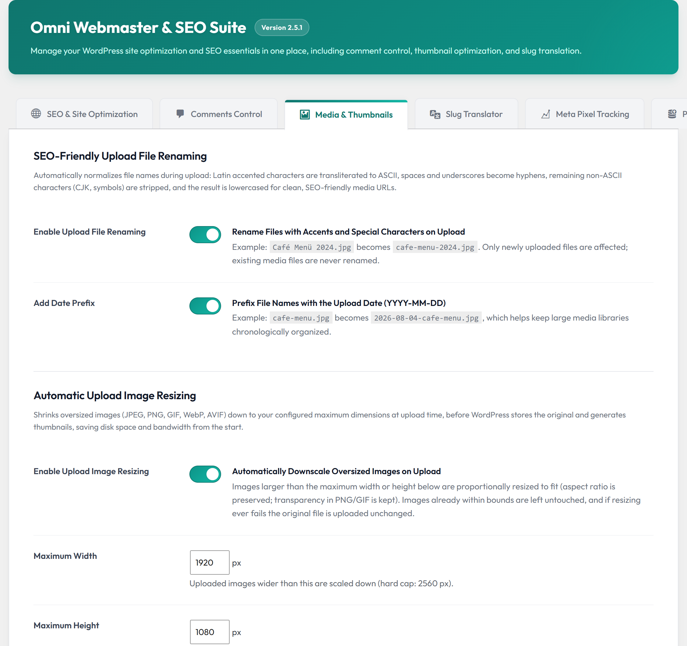
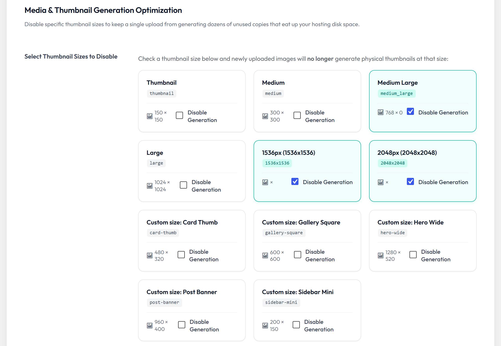
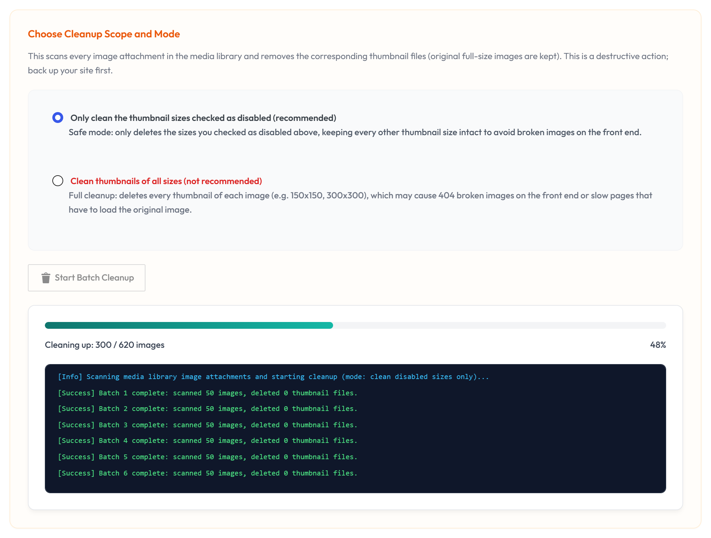
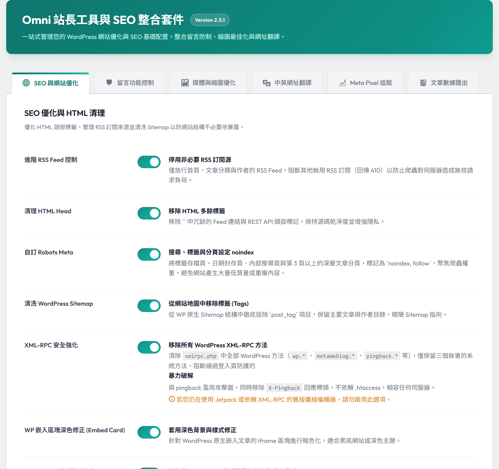

# Omni Webmaster & SEO Suite（全方位站長 SEO 工具套件）

[English Version README](README.md) | [WordPress.org 官方外掛頁面](https://wordpress.org/plugins/omni-webmaster-seo-suite/)

一站式 WordPress 網站優化與 SEO 站長工具：清理 HTML head、進階 RSS 控制、完全停用留言、選擇性停用縮圖與批次清理、上傳檔名自動優化、上傳圖片自動縮圖、中文標題自動翻譯英文網址，以及 Meta Pixel 廣告追蹤整合——全部集中在單一設定面板管理。

> 🌟 **已通過 WordPress 官方審查並正式上架**：[WordPress.org 官方外掛頁面](https://wordpress.org/plugins/omni-webmaster-seo-suite/)

   

## 畫面截圖（Screenshots）

### 1. SEO 與網站優化設定面板

### 2. 上傳檔名優化與圖片自動縮圖

### 3. 選擇性停用縮圖尺寸

### 4. AJAX 縮圖批次清理工具

### 5. 內建繁體中文介面

## 功能模組

### 1. SEO 與優化
- **進階 RSS 控制**：停用非必要的 RSS feed（回傳 HTTP 410）以降低爬蟲負載，僅保留首頁、分類與作者 feed。
- **HTML Head 清理**：移除多餘的 feed 連結、RSD、WLManifest、shortlink 與 REST API header 標記。
- **Robots Meta 客製化**：自動將標籤彙整頁、日期彙整頁、站內搜尋與深層分頁（第 3 頁以上）標記為 `noindex, follow`，集中搜尋權重。
- **Sitemap 淨化**：從 WordPress 原生 sitemap 排除 `post_tag`，避免低品質彙整頁被索引。
- **XML-RPC 安全強化**（選用）：移除全部 WordPress XML-RPC 方法（`wp.*`、`metaWeblog.*`、`pingback.*` 等），僅保留三個無害的系統方法——阻斷 `xmlrpc.php` 暴力破解與 pingback 濫用，相容任何伺服器、不依賴 `.htaccess`。

### 2. 留言控制
- **全面停用留言**：一次關閉所有文章類型的留言、引用（trackback）與 pingback，隱藏歷史留言並移除後台的留言選單與小工具。

### 3. 媒體與縮圖優化
- **上傳檔名 SEO 優化**：上傳時自動將重音字母轉為 ASCII、空格與底線轉為連字號、移除非 ASCII 字元並轉為小寫（例：`Café Menü 2024.jpg` → `cafe-menu-2024.jpg`），並可選擇加上 `YYYY-MM-DD` 日期前綴。另可改用時間流水號模式，所有上傳檔案一律命名為 `2026-09-04-153012.jpg`，媒體庫標題仍保留上傳時的原始檔名（`今日快訊`），因此仍可用原檔名搜尋。與獨立外掛 [smart-file-renamer](https://github.com/ivanusto/smart-file-renamer) 共用核心邏輯。
- **上傳圖片自動縮圖**：上傳時將過大的 JPEG/PNG/GIF/WebP/AVIF 圖片等比例縮小至設定的最大尺寸（上限 2560px），在原圖儲存與縮圖產生之前就完成，並可調整壓縮品質、保留 PNG/GIF 透明度。失敗時自動放行：若伺服器缺少 GD 或縮圖失敗，直接以原圖上傳、不會中斷。與獨立外掛 [smart-image-upload-resizer](https://github.com/ivanusto/smart-image-upload-resizer) 共用核心邏輯。
- **選擇性停用縮圖**：上傳圖片時停止產生指定尺寸的縮圖，節省儲存空間。
- **AJAX 縮圖批次清理**：安全的批次清理工具（每次處理 50 個附件），遞迴刪除歷史縮圖檔案並即時顯示進度條。
- **防衝突機制**：偵測到獨立版 Smart File Renamer 或 Smart Image Upload Resizer 外掛啟用時，對應模組自動停用並在設定頁顯示提示，避免檔案被重複改名或重複縮圖。

### 4. 網址代稱翻譯（Slug Translator）
- **中文標題自動轉英文網址**：透過 Google Cloud Translation API 將中文文章標題翻譯為乾淨的小寫英文網址代稱（Slug）；未設定金鑰時自動改用免金鑰公開端點。
- 本模組與獨立外掛 [Chinese to English Slug Converter (zh-to-en-slug)](https://github.com/ivanusto/zh-to-en-slug) 共用核心邏輯——若您只需要網址翻譯功能，建議直接使用該獨立外掛。

### 5. Meta Pixel 追蹤
- **Meta（Facebook）Pixel 整合**：自動載入 PageView、ViewContent（單篇文章與頁面）與 Search 事件追蹤。
- **乾淨的受眾資料**：預設排除網站工作人員（具 `edit_posts` 權限的登入使用者），並且不在 feed、預覽與 oEmbed 頁面載入追蹤代碼。

### 6. 文章數據匯出
- **按月 CSV 匯出**：直接在後台預覽並按月份匯出文章數據，支援自訂瀏覽量欄位（Meta Key）。

### 7. Meta 標籤與結構化資料
- **首頁輸出**：Meta Description、Open Graph 社群分享標籤（`og:title`、`og:description`、`og:image`、`twitter:card`）與 Schema.org WebSite/Organization JSON-LD——未安裝大型 SEO 外掛時的輕量替代方案。
- **單篇文章與頁面輸出**（預設關閉）：`og:type=article`、標題、描述、含寬高與替代文字的 `og:image`、`article:published_time`、`article:modified_time`、Twitter Card 標籤與 BlogPosting/WebPage JSON-LD。分享圖依序退回精選圖片 → 內文第一張圖片 → 全站預設分享圖；描述優先使用手動摘要，未填寫時取內文前 160 字。
- **防衝突機制**：偵測到大型 SEO 外掛（Yoast SEO、Rank Math、All in One SEO、SEOPress、The SEO Framework）時自動停止輸出，避免標籤重複。若佈景主題已自行輸出 OG 標籤，請保持單篇開關關閉。
- **媒體庫選取器**：直接從媒體庫選取 `og:image` 分享圖（建議 1200 × 630），支援即時預覽與描述字數計算。

## 系統需求

- WordPress 6.0 或更高版本
- PHP 7.4 或更高版本
- （選填）Google Cloud Translation API 金鑰——未填寫時會自動使用免金鑰公開端點進行翻譯

## 安裝步驟

1. 從[最新版 Release](https://github.com/ivanusto/omni-webmaster-seo-suite/releases/latest) 下載附件的 `omni-webmaster-seo-suite-X.Y.zip`（**請勿**使用自動產生的 Source code zip）
2. 透過 WordPress 後台 **外掛 > 安裝外掛 > 上傳外掛** 上傳安裝，或解壓縮至 `/wp-content/plugins/` 目錄
3. 在 **「外掛」** 頁面啟用此外掛
4. 前往 **設定 > Omni Webmaster** 進行設定

## 常見問題 (FAQ)

**翻譯功能需要 API 金鑰嗎？**
不需要，金鑰為選填。設定 Google Cloud Translation API 金鑰時使用官方 Cloud API；金鑰留空（或 Cloud API 呼叫失敗）時，外掛會自動改用免金鑰的 Google Translate 公開端點。

**刪除縮圖會刪掉我的原始圖片嗎？**
不會。清理工具只刪除縮放產生的子尺寸檔案，您上傳的原始圖片完全安全。

**舊有獨立外掛的設定會自動搬移過來嗎？**
不會。本外掛使用單一整合的設定陣列（`omni_webmaster_settings`）以避免資料庫雜亂，請在新的後台設定面板重新勾選所需選項。

## 版本紀錄

完整版本紀錄請參閱 [readme.txt](readme.txt) 的 Changelog 章節。

## 專案起源

本套件由作者先前撰寫的六個獨立外掛整合最佳化而來，並額外加入 Meta Pixel 追蹤與文章數據按月匯出功能：

- [disable-all-thumbnails](https://github.com/ivanusto/disable-all-thumbnails)——停用 WordPress 指定縮圖格式的生成
- [disable-all-comments](https://github.com/ivanusto/disable-all-comments)——完全禁用 WordPress 網站的所有留言功能
- [zh-to-en-slug](https://github.com/ivanusto/zh-to-en-slug)——自動將中文文章標題翻譯成英文 Slug（仍持續維護，並與本套件的網址代稱翻譯模組同步）
- [smart-image-upload-resizer](https://github.com/ivanusto/smart-image-upload-resizer)——圖片上傳自動縮圖並支援 WebP / AVIF
- [smart-file-renamer](https://github.com/ivanusto/smart-file-renamer)——上傳時自動重新命名含變音符號與特殊字元的檔案以提升 SEO
- [modern-rss-image-feed](https://github.com/ivanusto/modern-rss-image-feed)——為 RSS 訂閱源提供現代圖片格式（WebP、AVIF）支援

若您只需要單一功能，這些獨立外掛皆可繼續使用。

## 姊妹作品

- [Omni Performance Hardening](https://github.com/ivanusto/omni-wp-perf-hardening)——專為高流量與大內容 WordPress 站台打造的效能強化與爬取收斂外掛，用以收斂站內搜尋全表掃描、`SQL_CALC_FOUND_ROWS`、低價值 Feed 與 oEmbed 端點，並優化 CDN 快取標頭。與本套件形成互補（本套件負責曝光與 SEO 索引，該套件負責伺服器效能與負載收斂）。

## 授權條款

本專案採用 [GNU General Public License v2.0 or later（GPL-2.0-or-later）](LICENSE) 授權條款。
